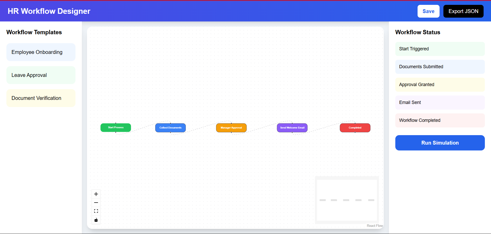
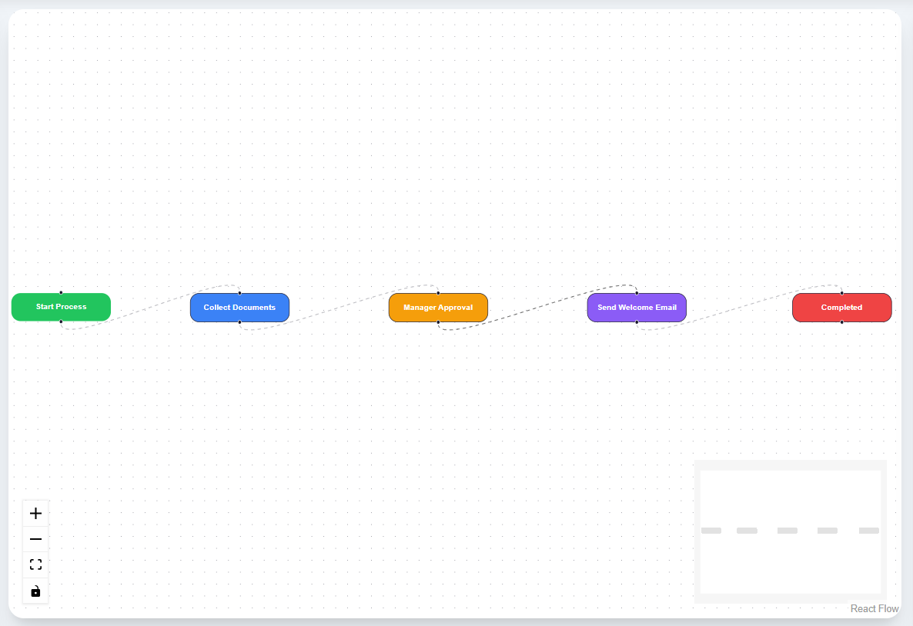

# HR Workflow Designer

Modern visual HR workflow builder for onboarding, approvals and internal process automation.

## Features

- Visual workflow builder using React Flow
- Prebuilt HR workflow nodes
- Real-time workflow status panel
- Save and Export controls
- Modern responsive dashboard UI
- Built with TypeScript for scalability

## Screenshots

## Tech Stack

React • TypeScript • Tailwind CSS • React Flow • Vite

## Run Locally

npm install  
npm run dev

## Author

Parth Mishra
